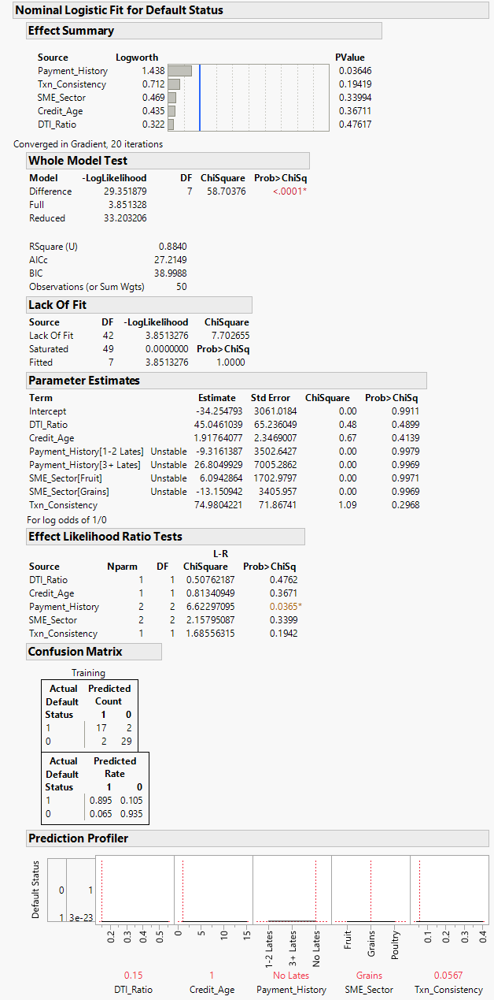

# 🏦 Case Study: Conservative Credit Scoring for Agri-SMEs
**Objective:** Minimize capital risk in Kenyan agricultural lending through predictive modeling.

## 🔍 The Business Problem
Standard lending models often prioritise volume, resulting in high default rates. Our "Training" data initially showed 2 false negatives—cases in which the model predicted "Pay" but the borrower defaulted. For a conservative bank, even a 5% error rate on defaults is unacceptable.

## 🛠️ The Technical Solution
Using **Nominal Logistic Regression** in JMP, I analyzed five key variables to determine the probability of default.

### Key Performance Drivers:
* **DTI_Ratio:** Risk remains low until 0.25 (25%), then spikes vertically.
* **Txn_Consistency:** Variance in revenue above 0.15 is a primary trigger for default.
* **Payment History:** "No Lates" is the strongest anchor for a safe profile.

## 🛡️ The "Conservative" Optimization
By setting the **Desirability** for Default (1) to zero and Repayment (0) to one, I identified the "Safe Haven" profile:
* **Optimal DTI:** ~0.15
* **Optimal Revenue Variance:** < 0.04
* **Resulting Default Probability:** **2e-21** (Virtually Zero).

## 🚀 Deployment & Operationalization
I exported the JMP prediction formula into an automated **Google Sheets Credit Engine**.
* **Strict Threshold:** Loans are only approved if the predicted probability of default is **< 10%**.
* **Result:** This stricter threshold successfully filters out the "False Negatives" identified during model training.
---
## 📊 Full Model Analysis (JMP 18)
The following report shows the logistic regression fit, where we achieved an **RSquare(U) of 0.884** and identified the critical risk triggers for the portfolio.

Technical Note on Parameter Stability: > "The 'Unstable' markers in the parameter estimates are a result of Perfect Separation in the training data (e.g., all borrowers with 3+ Lates defaulted). While this can inflate standard errors, it confirms the high predictive power of these categorical variables in identifying absolute risk zones."
